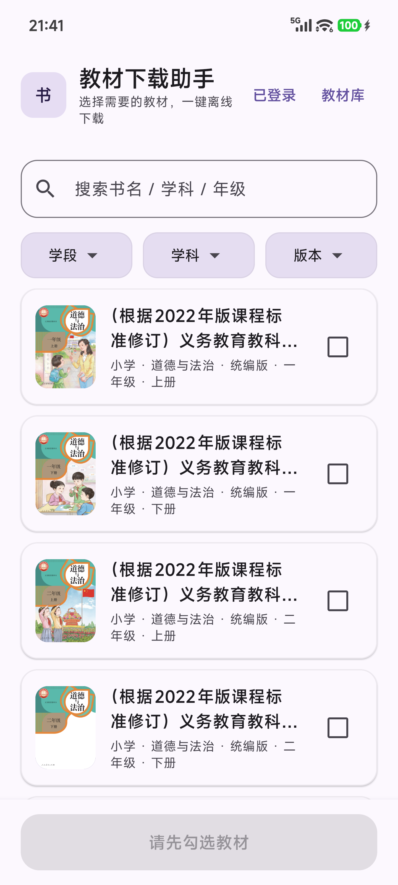
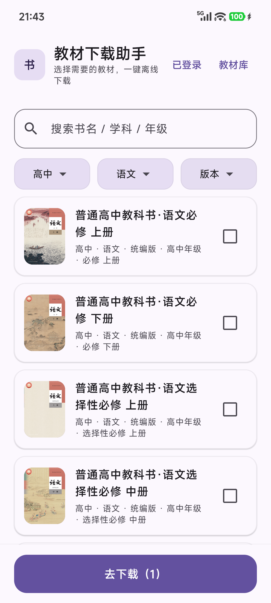
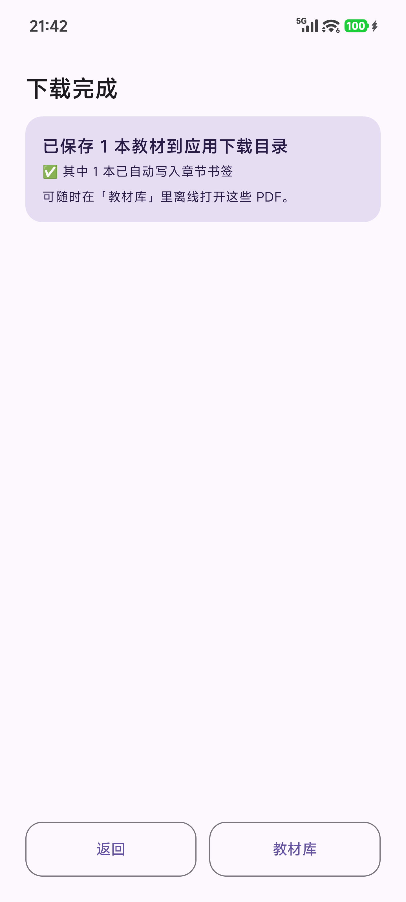
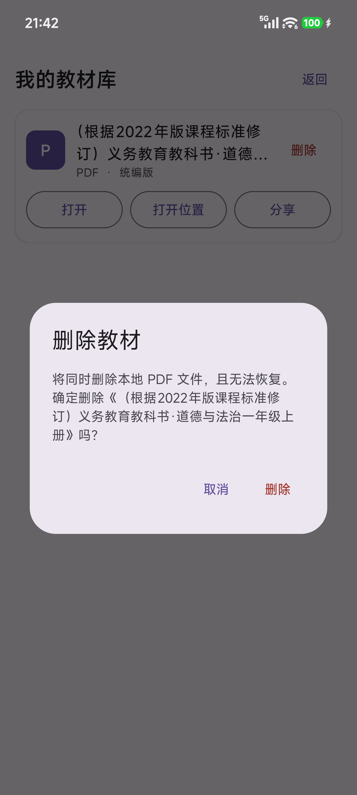
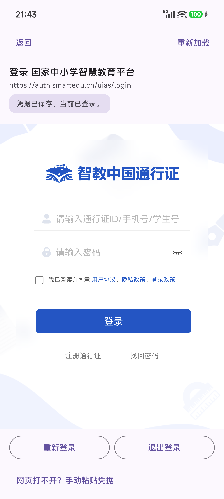

# 教材下载助手 (textbook-download-assistant)

安卓手机端电子课本下载工具，用分步引导带用户完成「浏览选择教材 → 应用内登录 → 解析 → 下载」全流程。基于开源项目 [tchMaterial-parser](https://github.com/happycola233/tchMaterial-parser)（MIT 许可）二次开发，并按 MIT 要求保留上游版权声明。

> 本项目仅供个人学习与教学参考，所下载资源版权归国家中小学智慧教育平台及相关权利人所有，请勿用于商业用途或二次分发。

## 功能

- 分步引导式下载流程，无需用户懂技术。
- 应用内浏览国家平台教材目录，按「学段 → 学科 → 版本」级联筛选并搜索。
- 手机端内嵌官网登录页，自动读取登录凭据；同时提供手动粘贴凭据、重新登录、退出登录。
- 勾选任意多本教材后逐个解析、逐个下载，单本失败不阻断其余。
- 下载后自动按课本标题命名，并尝试写入 PDF 书签。
- **教材库**：下载后的课本进入本地库，支持打开、打开所在位置、分享、删除；删除会同时删除本地文件。
- 完全免费；自愿赞助与「GitHub Star + 邮箱」免费授权码属于后续计划，当前版本不锁定下载功能。

## 本地运行

1. 用 Android Studio 打开本项目根目录（需支持 AGP 9.0.1 的版本，例如 Quail 3）。
2. 等待 Gradle 同步（首次较慢）。
3. 连接模拟器或真机（Android 5.0/API 21 及以上），点 Run。
4. 在首页选择教材，按界面提示完成登录与下载。

命令行构建（Windows）：

```powershell
$env:JAVA_HOME = "C:\Program Files\Android\Android Studio\jbr"
$env:ANDROID_HOME = "$env:LOCALAPPDATA\Android\Sdk"
.\gradlew.bat assembleDebug
```

项目已包含 Gradle Wrapper（当前 9.1.0），无需再执行 `gradle wrapper --gradle-version ...`。

## 登录凭据说明

App 内会打开国家中小学智慧教育平台登录页。登录成功后，App 会自动从页面 `localStorage` 读取 `access_token / mac_key / diff` 并保存；也支持手动粘贴凭据。凭据过期后重新登录即可。

凭据在 Android 6.0/API 23 及以上使用 Android Keystore AES/GCM 加密后存入 DataStore；Android 5.0/5.1（API 21-22）没有可用的 Keystore AES/GCM，退化为应用私有目录内 Base64 存储。凭据不会写入日志或提交到仓库。

## 数据层说明

本项目当前没有服务端数据库，也没有 SQL 建表脚本：

- 登录凭据：DataStore（`credentials`）。
- 教材库索引：应用私有目录 `library.json`。
- 教材目录缓存：应用私有目录 `catalog_cache.jsonl`（12 小时有效期，过期自动联网刷新）。
- 下载文件：应用专属外部下载目录。

如果后续接入授权码或赞助后端，再补充对应的服务端数据库初始化脚本；当前版本不伪造未使用的数据库。

## 构建与测试

```powershell
.\gradlew.bat testDebugUnitTest
.\gradlew.bat lintDebug
.\gradlew.bat assembleDebug
```

单元测试位于 `app/src/test`，覆盖签名/凭据解析、教材库文件删除和 PDF 书签写入。

## 验证记录（本地实测）

- 构建：`assembleDebug` 通过；静态检查 `lintDebug` 0 error。
- 单元测试：16 个用例全部通过（`testDebugUnitTest`）。
- Android 5.0.2 / API 21 模拟器：冷启动正常，教材目录与封面缩略图加载正常，勾选教材、进入登录页、展开手动凭据入口均正常，无崩溃。
- 目录缓存：首次联网生成 `catalog_cache.jsonl`（约 1.2 MB），二次冷启动约 0.7 秒完成首屏。
- 真机（小米 15S Pro / Android 16）：级联筛选、封面缩略图、登录与退出、批量下载、PDF 书签写入、教材库打开/分享/删除均正常；154 页课本实测写入 88 个多级书签。

## 截图

| 首页浏览 | 级联筛选 | 勾选教材 | 解析结果 |
| --- | --- | --- | --- |
|  |  |  |  |

| 下载完成（含书签） | 教材库 | 删除确认 | 登录管理 |
| --- | --- | --- | --- |
|  |  |  |  |

## 许可证与致谢

本工程采用 MIT 许可，完整文本见 [LICENSE](LICENSE)。二次开发所依赖的上游 [tchMaterial-parser](https://github.com/happycola233/tchMaterial-parser) 使用 MIT 许可，作者：肥宅水水呀；版权与许可声明见 [THIRD_PARTY_NOTICES.md](THIRD_PARTY_NOTICES.md)。

本项目与上游作者、国家中小学智慧教育平台均无隶属或合作关系。
