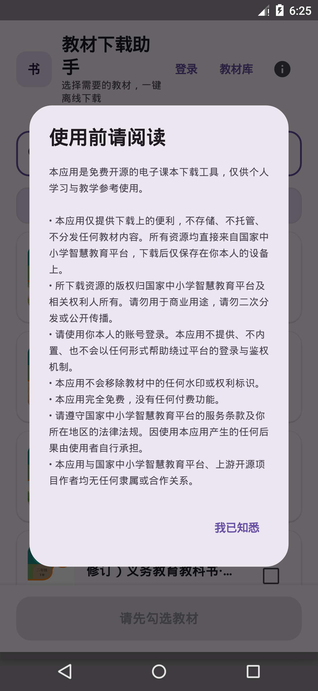
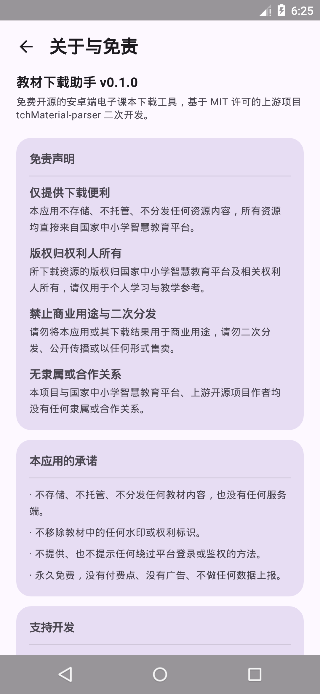
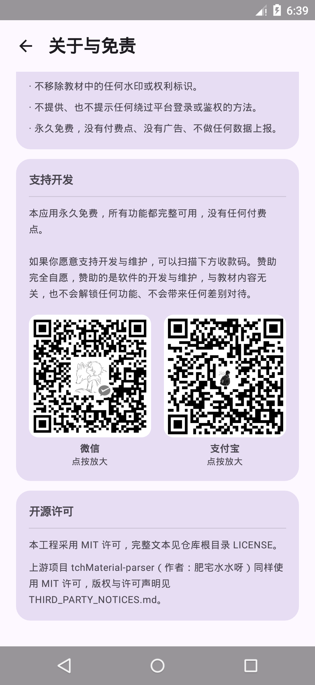
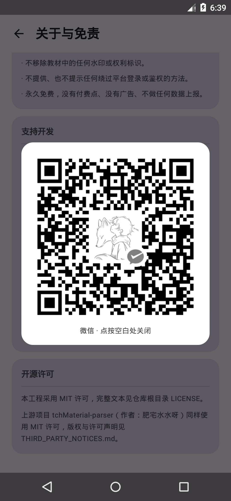

# 教材下载助手 (textbook-download-assistant)

手机端电子课本下载工具，用分步引导带用户完成「浏览选择教材 → 应用内登录 → 解析 → 下载」全流程。提供 **Android 版**（APK）与 **iOS 版**（未签名 IPA，需自行签名安装）。基于开源项目 [tchMaterial-parser](https://github.com/happycola233/tchMaterial-parser)（MIT 许可）二次开发，并按 MIT 要求保留上游版权声明。

## 免责声明

- **仅提供下载便利**：本应用不存储、不托管、不分发任何资源内容，所有资源均直接来自国家中小学智慧教育平台。
- **版权归权利人所有**：所下载资源的版权归国家中小学智慧教育平台及相关权利人所有，请仅用于个人学习与教学参考。
- **禁止商业用途与二次分发**：请勿将本应用或其下载结果用于商业用途，请勿二次分发、公开传播或以任何形式售卖。
- **无隶属或合作关系**：本项目与国家中小学智慧教育平台、上游开源项目作者均没有任何隶属或合作关系。

使用本应用时请遵守国家中小学智慧教育平台的服务条款及你所在地区的法律法规。因使用本应用产生的任何后果由使用者自行承担。

## 功能

- 分步引导式下载流程，无需用户懂技术。
- 应用内浏览国家平台教材目录，按「学段 → 学科 → 版本」级联筛选并搜索。
- 手机端内嵌官网登录页，自动读取登录凭据；同时提供手动粘贴凭据、重新登录、退出登录。
- 勾选教材后逐个解析、逐个下载（单次上限 10 本，见「本项目的红线」），单本失败不阻断其余。
- 下载后自动按课本标题命名，并尝试写入 PDF 书签。
- **教材库**：下载后的课本进入本地库，支持打开、打开所在位置、分享、删除；删除会同时删除本地文件。
- **关于与免责**：应用内提供完整免责声明、本应用的承诺与开源许可；首次启动需确认使用声明后才能使用。
- **永久免费**：没有付费点、没有功能锁、没有广告，也不做任何数据上报。自愿赞助见「赞助」一节。

## 下载安装

安装包只在 GitHub Releases 提供，**不上架任何应用商店**（个人开发者无法完成教育类 App 的备案资质，详见「本项目的红线」）。

1. 到 [Releases](https://github.com/Hi-Jiajun/textbook-download-assistant/releases) 下载最新版本的 `textbook-download-assistant-<版本号>-release.apk`。
2. 核对校验值（同名文件旁的 `SHA256SUMS.txt`，本地校验）：

   ```powershell
   Get-FileHash .\textbook-download-assistant-v0.1.0-release.apk -Algorithm SHA256
   ```

   ```bash
   sha256sum textbook-download-assistant-v0.1.0-release.apk
   ```

3. 手机上允许「安装未知来源应用」后安装，首次启动需阅读并确认使用声明。
4. 如果之前装过用调试密钥签名的包（`assembleDebug` 产出的 APK），需要先卸载再安装——签名不同无法覆盖安装，卸载会清空本地教材库记录。

系统要求：Android 5.0（API 21）及以上。

> 发布包由项目维护者本人签名（证书 CN=`Hi-Jiajun`）。如果你拿到的 APK 签名对不上，请不要安装。

## iOS 版（需自行签名安装）

iOS 版**不上架 App Store**：大陆区需要 ICP 备案号（个人拿不到），海外区则受《App 审核指南》5.2.1 知识产权条款限制。因此改为提供**未签名 IPA**，由你自己用 Apple ID 重签后安装——签的是你自己的证书，与任何第三方共享证书无关。

1. 到 Releases 下载 `textbook-download-assistant-v0.1.0-ios-unsigned.ipa`。
2. 电脑上安装 [AltStore](https://altstore.io/) 或 [Sideloadly](https://sideloadly.io/)，用数据线连接 iPhone，选你自己的 Apple ID 完成签名并安装。
3. 首次安装后，在 iPhone 的「设置 → 通用 → VPN 与设备管理」里信任你的开发者证书。
4. 免费 Apple ID 的限制：证书 **7 天有效**、同时最多 3 个自签 App、到期需重新签名（AltStore 可在同一 Wi-Fi 下自动续签）。加入 Apple Developer Program（$99/年）后有效期变为 1 年。

> 系统要求：iOS 15 及以上。IPA 里不含任何 Apple 证书，也不含任何账号信息；请只从本仓库下载，不要安装来源不明的 IPA。
> 功能与 Android 版一致：浏览目录、应用内登录、解析、下载、写入 PDF 章节书签、教材库；「关于与免责」页同样内置。

## 本地运行

1. 用 Android Studio 打开本项目根目录（需支持 AGP 9.0.1 的版本，例如 Quail 3）。
2. 等待 Gradle 同步（首次较慢）。
3. 连接模拟器或真机（Android 5.0/API 21 及以上），点 Run。
4. 在首页选择教材，按界面提示完成登录与下载。

命令行构建（Windows）：

```powershell
$env:JAVA_HOME = "C:\Program Files\Android\Android Studio\jbr"
$env:ANDROID_HOME = "$env:LOCALAPPDATA\Android\Sdk"
.\gradlew.bat assembleDebug
```

项目已包含 Gradle Wrapper（当前 9.1.0），无需再执行 `gradle wrapper --gradle-version ...`。

## 登录凭据说明

App 内会打开国家中小学智慧教育平台登录页。登录成功后，App 会自动从页面 `localStorage` 读取 `access_token / mac_key / diff` 并保存；也支持手动粘贴凭据。凭据过期后重新登录即可。

凭据在 Android 6.0/API 23 及以上使用 Android Keystore AES/GCM 加密后存入 DataStore；Android 5.0/5.1（API 21-22）没有可用的 Keystore AES/GCM，退化为应用私有目录内 Base64 存储。凭据不会写入日志或提交到仓库。

## 数据层说明

本项目当前没有服务端数据库，也没有 SQL 建表脚本：

- 登录凭据：DataStore（`credentials`）。
- 教材库索引：应用私有目录 `library.json`。
- 教材目录缓存：应用私有目录 `catalog_cache.jsonl`（12 小时有效期，过期自动联网刷新）。
- 下载文件：应用专属外部下载目录。

本项目不设服务端，也不接入任何后端服务，因此没有建表脚本。

## 构建与测试

```powershell
.\gradlew.bat testDebugUnitTest
.\gradlew.bat lintDebug
.\gradlew.bat assembleDebug
```

单元测试位于 `app/src/test`，覆盖签名/凭据解析、教材库文件删除和 PDF 书签写入。

## 验证记录（本地实测）

- 构建：`assembleDebug` 通过；静态检查 `lintDebug` 0 error / 8 warning（均为「依赖有新版本」与第三方库误报）。
- 发布包：`assembleRelease`（R8 压缩混淆）构建通过，签名后 8.3 MB（debug 包 23.3 MB）；API 21 实测可正常启动、确认声明、浏览目录、打开「关于与免责」，无崩溃。
- 单元测试：20 个用例全部通过（`testDebugUnitTest`）。其中 4 个是 Compose 渲染/交互冒烟测试：合规界面（关于与免责、首次启动声明）与下载页的失败态（失败时必须能「重试」或「返回首页」）。
- Android 5.0.2 / API 21 模拟器：冷启动正常，教材目录与封面缩略图加载正常，勾选教材、进入登录页、展开手动凭据入口均正常，无崩溃。
- 合规界面（API 21 模拟器实测）：首次启动弹出使用声明，按返回键无法跳过，点击「我已知悉」后才进入应用；同意后重启不再弹出；「关于与免责」页的免责声明四段、承诺条目、赞助说明与两张收款码均正常渲染，点按收款码可放大（见 `screenshots/09`–`12`）。
- 收款码可用性：内置的微信 / 支付宝收款码用解码器（zxing-cpp）实测可正常识别，并排显示的小尺寸版本同样能解出内容（`wxp://…` 与 `https://qr.alipay.com/…`）。
- 健壮性修补（真机/模拟器实测）：勾选超过 10 本时首页会直接给出提示（原先点了「去下载」毫无反应）；解析中途按返回不会再被拽回解析页；下载失败后可从失败的那一本继续重试，不再卡死在没有出口的页面；401/403 会提示「登录状态已失效，请重新登录」并自动清掉失效凭据；封面预热与进度回调均已节流。
- 目录缓存：首次联网生成 `catalog_cache.jsonl`（约 1.2 MB），二次冷启动约 0.7 秒完成首屏。
- 真机（小米 15S Pro / Android 16）：级联筛选、封面缩略图、登录与退出、批量下载、PDF 书签写入、教材库打开/分享/删除均正常；154 页课本实测写入 88 个多级书签。

## 截图

| 首页浏览 | 级联筛选 | 勾选教材 | 解析结果 |
| --- | --- | --- | --- |
|  |  |  |  |

| 下载完成（含书签） | 教材库 | 删除确认 | 登录管理 |
| --- | --- | --- | --- |
|  |  |  |  |

| 首次启动使用声明 | 关于与免责 | 关于页·赞助说明 | 收款码放大 |
| --- | --- | --- | --- |
|  |  |  |  |

## 本项目的红线

以下三条在本项目中**永不实现**，也不接受任何形式的补丁：

1. **永不移除水印或权利标识。** 教材中的水印属于权利人的技术措施与权利管理信息，移除它可能独立构成违法。
2. **永不实现绕过平台登录 / 鉴权的方法。** 应用只使用用户本人在官网登录后得到的凭据，不内置账号、不共享凭据、不做匿名降级；上游项目提供的「未登录也可下载」替代方法，本项目明确不实现。遇到 401/403 如实报错。
3. **永不把教材内容上传、缓存或中转到我方服务器。** 本项目没有服务端，下载结果只写入用户本机。

为了让使用形态保持在「个人学习使用」而不是「批量抓取」，项目刻意保留了以下限制：

| 限制 | 位置 |
| --- | --- |
| 教材目录的多个清单文件串行拉取，请求之间固定间隔 1.5 秒 | `CatalogApi.REQUEST_INTERVAL_MS` |
| 单次最多下载 10 本，逐本之间间隔 2 秒 | `DownloadViewModel.MAX_BATCH_SIZE` / `DOWNLOAD_INTERVAL_MS` |
| 封面缩略图逐张、带间隔预热（上限 40 张，间隔 120 毫秒） | `BrowseScreen.kt` 的 `PREFETCH_LIMIT` / `PREFETCH_INTERVAL_MS` |

这些限制会拖慢速度，**请不要为了提高速度而移除它们**。

## 赞助

本项目**永久免费，没有任何付费点**：所有功能都完整可用，没有功能锁、没有广告、不做任何数据上报。

如果你愿意支持开发与维护，可以在应用的「关于与免责」页内扫描微信 / 支付宝收款码（点按可放大）。赞助完全自愿：

- 赞助的是**软件的开发与维护**，与教材内容无关；
- 赞助**不会解锁任何功能**，也不会带来任何差别对待；
- 不赞助同样可以完整使用全部功能。

应用不做任何赞助弹窗、提醒或引导 —— 收款码只在「关于与免责」页里，需要你自己翻到才能看到。

## 许可证与致谢

本工程采用 MIT 许可，完整文本见 [LICENSE](LICENSE)。二次开发所依赖的上游 [tchMaterial-parser](https://github.com/happycola233/tchMaterial-parser) 使用 MIT 许可，作者：肥宅水水呀；版权与许可声明见 [THIRD_PARTY_NOTICES.md](THIRD_PARTY_NOTICES.md)。

本项目与上游作者、国家中小学智慧教育平台均无隶属或合作关系。
